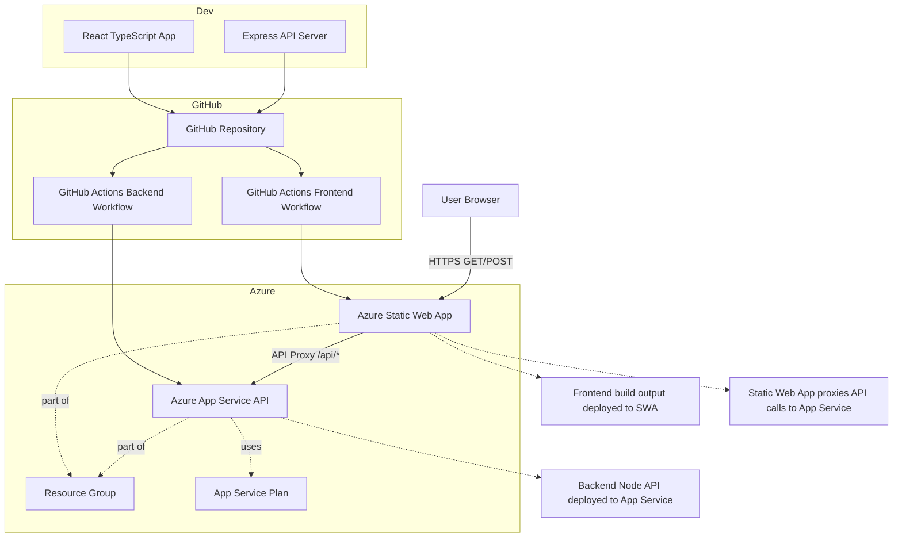

# System Architecture

```mermaid
flowchart TD
    subgraph Dev
        frontend[React TypeScript App]
        backend[Express API Server]
    end

    subgraph GitHub
        repo[GitHub Repository]
        gha_front[GitHub Actions Frontend Workflow]
        gha_back[GitHub Actions Backend Workflow]
    end

    subgraph Azure
        swa[Azure Static Web App]
        appsvc[Azure App Service API]
        rg[Resource Group]
        plan[App Service Plan]
    end

    user[User Browser]

    %% Dev to GitHub
    frontend --> repo
    backend --> repo

    %% GitHub Actions
    repo --> gha_front
    repo --> gha_back

    %% Deployments
    gha_front --> swa
    gha_back --> appsvc

    %% Azure infra
    swa -. part of .-> rg
    appsvc -. part of .-> rg
    appsvc -. uses .-> plan

    %% User flow
    user -- HTTPS GET/POST --> swa
    swa -- API Proxy /api/* --> appsvc

    %% Notes
    note1[Frontend build output deployed to SWA]
    note2[Backend Node API deployed to App Service]
    note3[Static Web App proxies API calls to App Service]

    swa -.-> note1
    appsvc -.-> note2
    swa -.-> note3
```